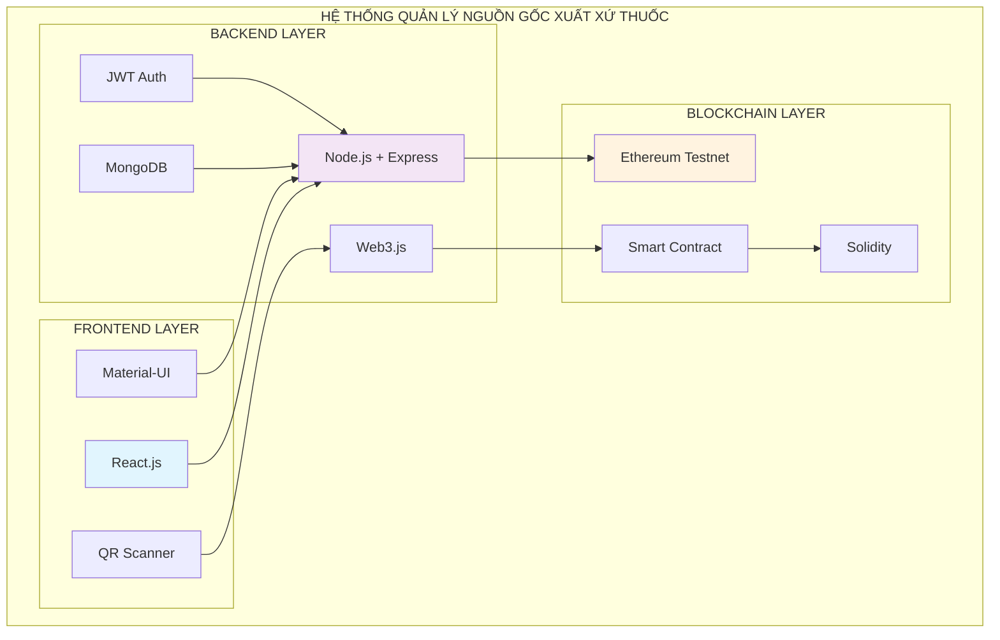
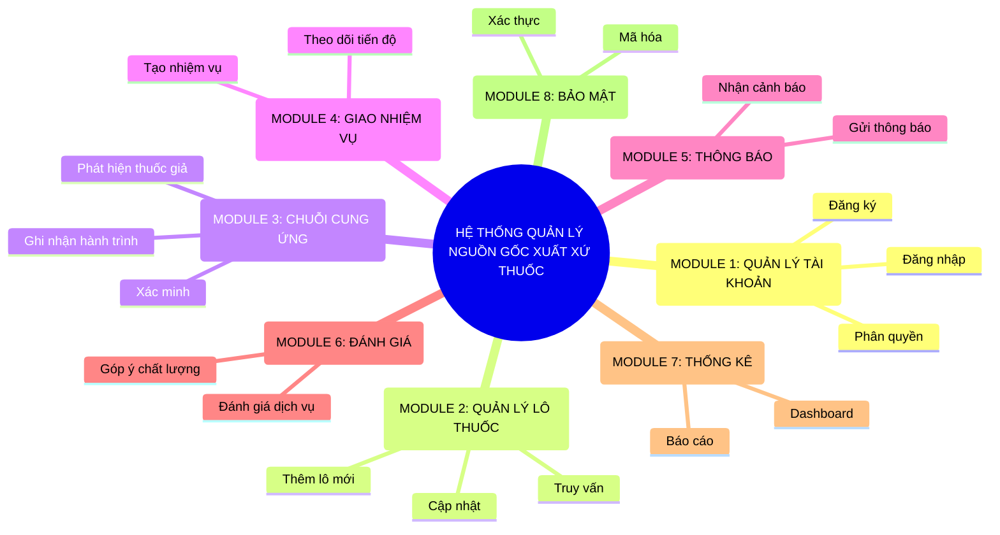
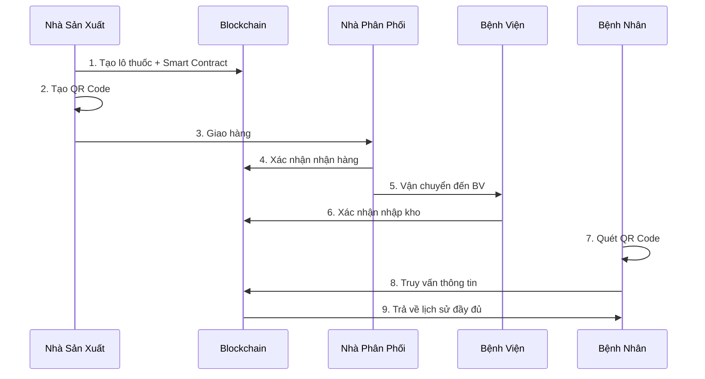
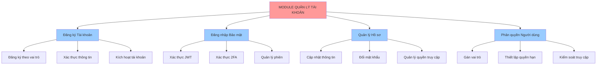
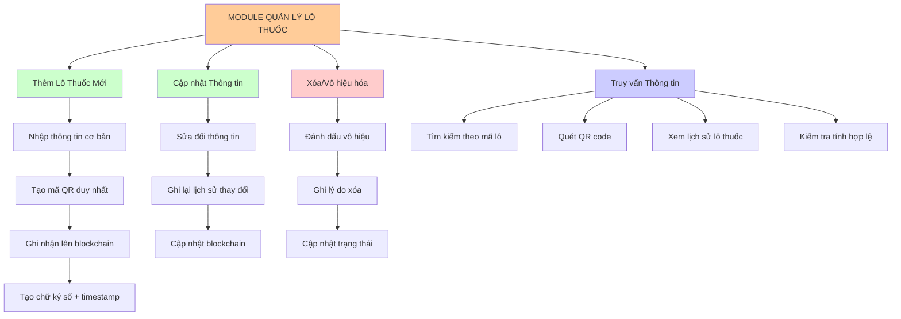
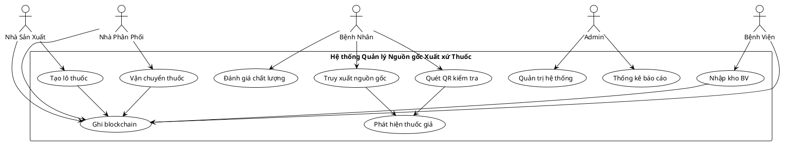
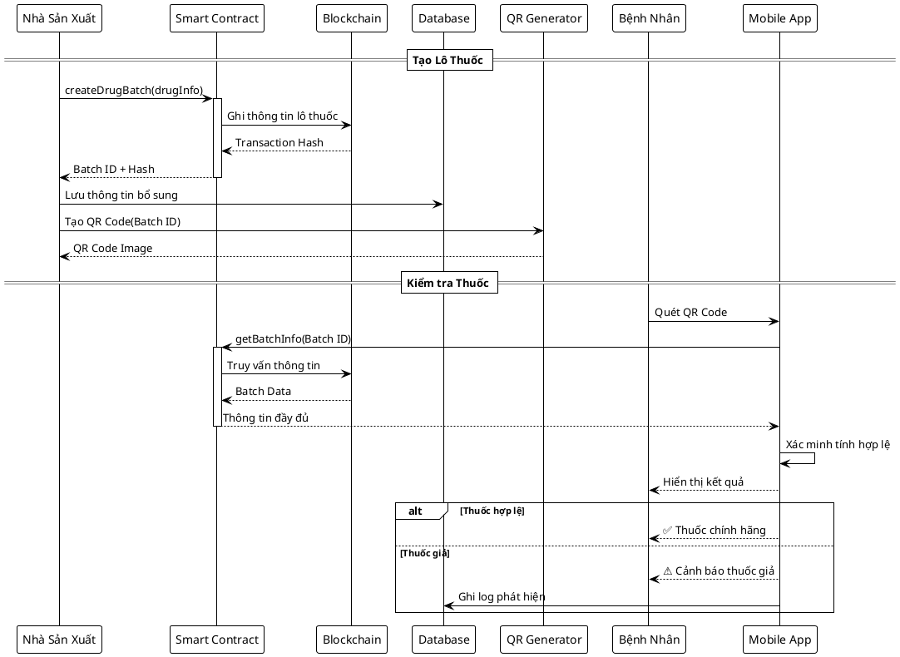

# MÃ VẼ SƠ ĐỒ PHÂN RÃ CHỨC NĂNG
## HỆ THỐNG QUẢN LÝ NGUỒN GỐC XUẤT XỨ THUỐC BẰNG BLOCKCHAIN

---

## 1. MÃ MERMAID - SƠ ĐỒ TỔNG QUAN HỆ THỐNG

### 1.1 Sơ đồ Kiến trúc Tổng quan



### 1.2 Sơ đồ Phân rã Chức năng Cấp 1



### 1.3 Sơ đồ Luồng Hoạt động Chính



---

## 2. MÃ MERMAID - SƠ ĐỒ CHI TIẾT TỪNG MODULE

### 2.1 Module Quản lý Tài khoản



### 2.2 Module Quản lý Lô Thuốc



### 2.3 Module Chuỗi Cung ứng (Core)

```mermaid
graph TD
    A[MODULE CHUỖI CUNG ỨNG] --> B[Ghi nhận Hành trình]
    A --> C[Xác minh Vận chuyển]
    A --> D[Phát hiện Thuốc giả]
    A --> E[Truy xuất Nguồn gốc]
    
    B --> B1[Sản xuất]
    B --> B2[Phân phối]
    B --> B3[Bệnh viện]
    
    B1 --> B11[Đăng ký thông tin sản xuất]
    B1 --> B12[Ghi nhận nguyên liệu]
    B1 --> B13[Kiểm tra chất lượng]
    
    B2 --> B21[Xác nhận nhận hàng]
    B2 --> B22[Ghi nhận điều kiện bảo quản]
    B2 --> B23[Cập nhật vị trí]
    
    B3 --> B31[Nhập kho bệnh viện]
    B3 --> B32[Quản lý tồn kho]
    B3 --> B33[Cấp phát cho bệnh nhân]
    
    C --> C1[Smart Contract validation]
    C --> C2[Kiểm tra chữ ký số]
    C --> C3[Xác thực timestamp]
    
    D --> D1[So sánh với blockchain]
    D --> D2[Kiểm tra tính toàn vẹn]
    D --> D3[Cảnh báo thuốc giả]
    
    E --> E1[Theo dõi đầy đủ hành trình]
    E --> E2[Hiển thị chuỗi cung ứng]
    E --> E3[Xác minh từng điểm chuyển giao]
    
    style A fill:#ff6666
    style B fill:#66ff66
    style C fill:#6666ff
    style D fill:#ffff66
    style E fill:#ff66ff
```



---

## 3. MÃ PLANTUML - SƠ ĐỒ TƯƠNG TÁC

### 3.1 Sơ đồ Use Case



### 3.2 Sơ đồ Sequence - Quy trình Tạo và Kiểm tra Lô thuốc



---

## 4. MÃ DRAW.IO/LUCIDCHART - XML FORMAT

### 4.1 Sơ đồ Kiến trúc Hệ thống (Draw.io XML)

```xml
<mxfile host="app.diagrams.net">
  <diagram name="Architecture">
    <mxGraphModel dx="1422" dy="794" grid="1" gridSize="10" guides="1">
      <root>
        <mxCell id="0"/>
        <mxCell id="1" parent="0"/>
        
        <!-- Frontend Layer -->
        <mxCell id="frontend" value="FRONTEND LAYER" style="rounded=1;whiteSpace=wrap;html=1;fillColor=#e1f5fe;" vertex="1" parent="1">
          <mxGeometry x="50" y="50" width="200" height="100" as="geometry"/>
        </mxCell>
        
        <!-- Backend Layer -->
        <mxCell id="backend" value="BACKEND LAYER" style="rounded=1;whiteSpace=wrap;html=1;fillColor=#f3e5f5;" vertex="1" parent="1">
          <mxGeometry x="300" y="50" width="200" height="100" as="geometry"/>
        </mxCell>
        
        <!-- Blockchain Layer -->
        <mxCell id="blockchain" value="BLOCKCHAIN LAYER" style="rounded=1;whiteSpace=wrap;html=1;fillColor=#fff3e0;" vertex="1" parent="1">
          <mxGeometry x="550" y="50" width="200" height="100" as="geometry"/>
        </mxCell>
        
        <!-- Connections -->
        <mxCell id="conn1" style="edgeStyle=orthogonalEdgeStyle;rounded=0;orthogonalLoop=1;jettySize=auto;html=1;" edge="1" parent="1" source="frontend" target="backend">
          <mxGeometry relative="1" as="geometry"/>
        </mxCell>
        
        <mxCell id="conn2" style="edgeStyle=orthogonalEdgeStyle;rounded=0;orthogonalLoop=1;jettySize=auto;html=1;" edge="1" parent="1" source="backend" target="blockchain">
          <mxGeometry relative="1" as="geometry"/>
        </mxCell>
        
      </root>
    </mxGraphModel>
  </diagram>
</mxfile>
```

---

## 5. MÃ GRAPHVIZ DOT - SƠ ĐỒ PHÂN CẤP

### 5.1 Sơ đồ Phân rã Chức năng

```dot
digraph "Drug_Traceability_System" {
    rankdir=TB;
    node [shape=box, style=filled];
    
    // Main System
    system [label="HỆ THỐNG QUẢN LÝ\nNGUỒN GỐC XUẤT XỨ THUỐC", fillcolor=lightblue];
    
    // Level 1 Modules
    mod1 [label="MODULE 1\nQUẢN LÝ TÀI KHOẢN", fillcolor=lightgreen];
    mod2 [label="MODULE 2\nQUẢN LÝ LÔ THUỐC", fillcolor=lightgreen];
    mod3 [label="MODULE 3\nCHUỖI CUNG ỨNG", fillcolor=orange];
    mod4 [label="MODULE 4\nGIAO NHIỆM VỤ", fillcolor=lightgreen];
    mod5 [label="MODULE 5\nTHÔNG BÁO", fillcolor=lightgreen];
    mod6 [label="MODULE 6\nĐÁNH GIÁ", fillcolor=lightgreen];
    mod7 [label="MODULE 7\nTHỐNG KÊ", fillcolor=lightgreen];
    mod8 [label="MODULE 8\nBẢO MẬT", fillcolor=red];
    
    // Level 2 Functions for Module 1
    mod1_1 [label="Đăng ký\nTài khoản", fillcolor=lightyellow];
    mod1_2 [label="Đăng nhập\nBảo mật", fillcolor=lightyellow];
    mod1_3 [label="Quản lý\nHồ sơ", fillcolor=lightyellow];
    mod1_4 [label="Phân quyền\nNgười dùng", fillcolor=lightyellow];
    
    // Level 2 Functions for Module 2
    mod2_1 [label="Thêm Lô\nThuốc Mới", fillcolor=lightyellow];
    mod2_2 [label="Cập nhật\nThông tin", fillcolor=lightyellow];
    mod2_3 [label="Xóa/Vô hiệu\nhóa Lô", fillcolor=lightyellow];
    mod2_4 [label="Truy vấn\nThông tin", fillcolor=lightyellow];
    
    // Level 2 Functions for Module 3 (Core)
    mod3_1 [label="Ghi nhận\nHành trình", fillcolor=pink];
    mod3_2 [label="Xác minh\nVận chuyển", fillcolor=pink];
    mod3_3 [label="Phát hiện\nThuốc giả", fillcolor=pink];
    mod3_4 [label="Truy xuất\nNguồn gốc", fillcolor=pink];
    
    // Connections
    system -> {mod1, mod2, mod3, mod4, mod5, mod6, mod7, mod8};
    
    mod1 -> {mod1_1, mod1_2, mod1_3, mod1_4};
    mod2 -> {mod2_1, mod2_2, mod2_3, mod2_4};
    mod3 -> {mod3_1, mod3_2, mod3_3, mod3_4};
    
    // Highlight core module
    mod3 [fillcolor=orange, penwidth=3];
}
```



---

## 6. MÃ FLOWCHART.JS - LUỒNG QUY TRÌNH

### 6.1 Luồng Sản xuất và Kiểm tra Thuốc

```
st=>start: Bắt đầu
nsx=>operation: Nhà sản xuất tạo lô thuốc
blockchain=>operation: Ghi thông tin lên Blockchain
qr=>operation: Tạo mã QR
pack=>operation: Đóng gói sản phẩm
dist=>operation: Phân phối đến NPP/BV
scan=>operation: Bệnh nhân quét QR
verify=>condition: Kiểm tra tính hợp lệ?
valid=>operation: Hiển thị thông tin hợp lệ
fake=>operation: Cảnh báo thuốc giả
log=>operation: Ghi log phát hiện
end=>end: Kết thúc

st->nsx->blockchain->qr->pack->dist->scan->verify
verify(yes)->valid->end
verify(no)->fake->log->end
```

---

## 7. HƯỚNG DẪN SỬ DỤNG

### 7.1 Mermaid
- Dán mã vào: https://mermaid.live/
- Hoặc sử dụng trong Markdown với ```mermaid

### 7.2 PlantUML
- Dán mã vào: https://www.plantuml.com/plantuml/
- Hoặc sử dụng plugin PlantUML trong IDE

### 7.3 Draw.io
- Mở https://app.diagrams.net/
- File > Import from > Text > Dán XML code

### 7.4 Graphviz
- Dán mã vào: https://dreampuf.github.io/GraphvizOnline/
- Hoặc cài đặt Graphviz local

### 7.5 Flowchart.js
- Dán mã vào: http://flowchart.js.org/
- Hoặc sử dụng trong web app

---

*Các mã trên có thể được sử dụng trực tiếp trong các công cụ vẽ diagram để tạo ra sơ đồ phân rã chức năng trực quan và chuyên nghiệp.*