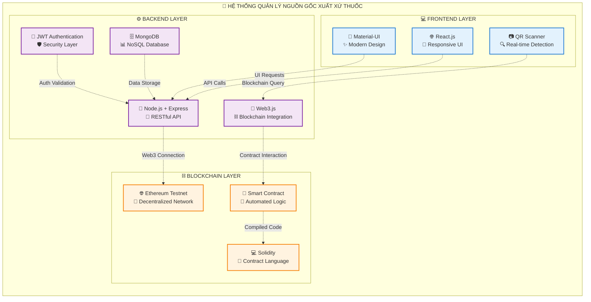
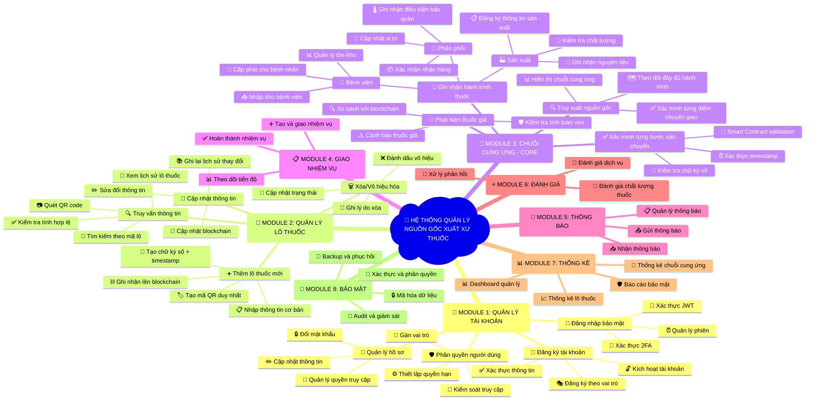
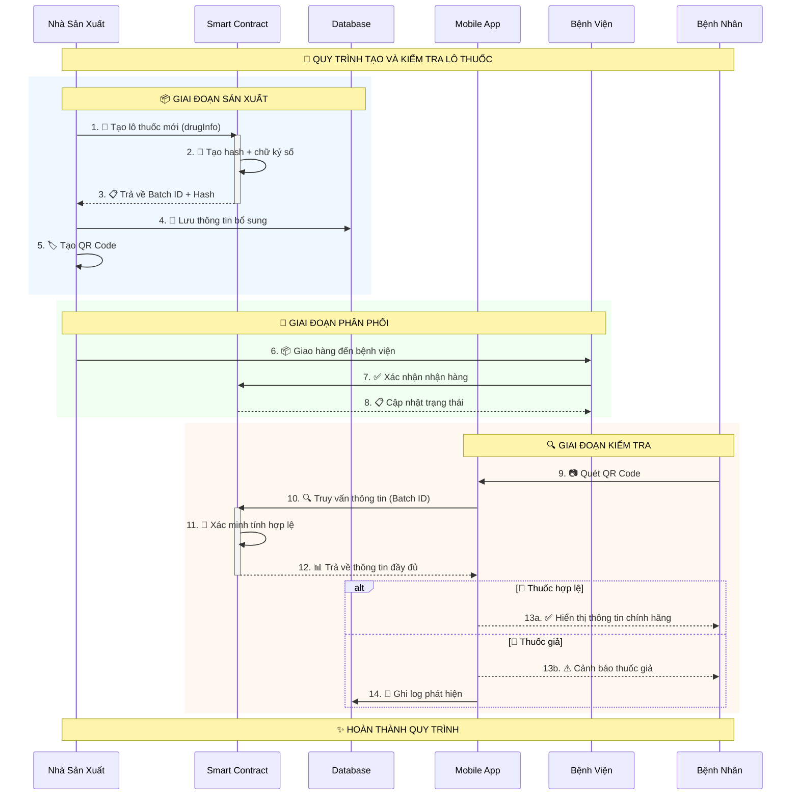
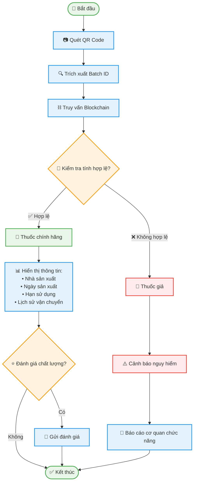
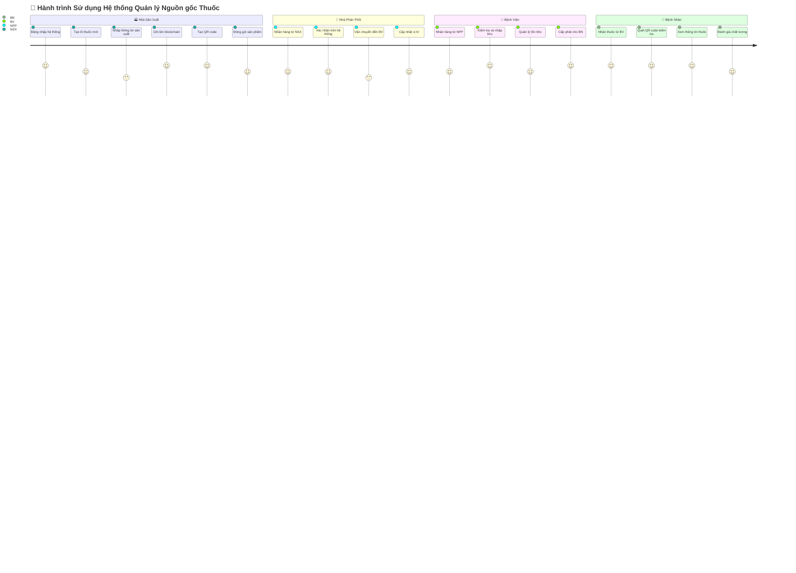
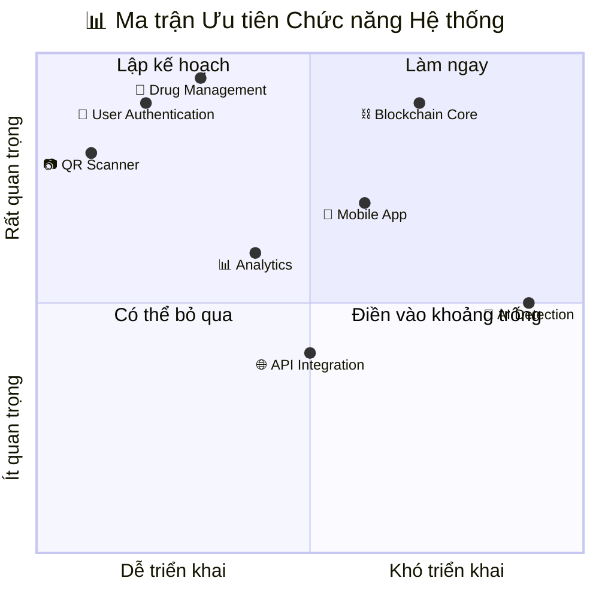
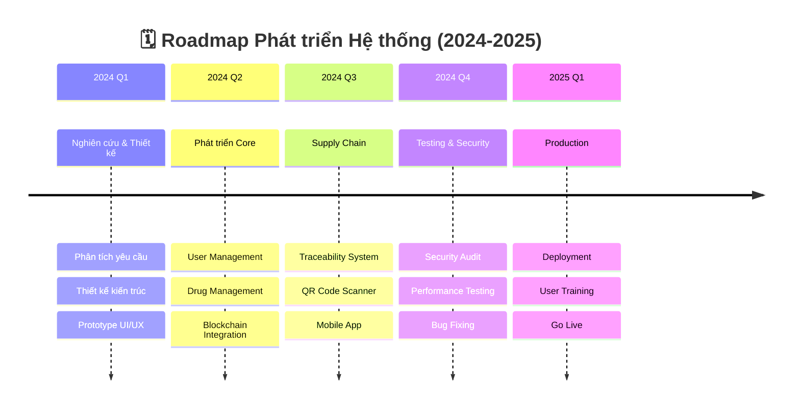

# SƠ ĐỒ TƯƠNG TÁC MERMAID - COPY & PASTE READY
## HỆ THỐNG QUẢN LÝ NGUỒN GỐC XUẤT XỨ THUỐC BẰNG BLOCKCHAIN

---

## 🎯 HƯỚNG DẪN NHANH
**Cách sử dụng:** Copy mã bên dưới → Dán vào https://mermaid.live/ → Xem kết quả ngay lập tức!

---

## 📊 1. SƠ ĐỒ TỔNG QUAN HỆ THỐNG (3D Style)



---

## 🧠 2. SƠ ĐỒ TƯ DUY - PHÂN RÃ CHỨC NĂNG



---

## 🔄 3. SEQUENCE DIAGRAM - QUY TRÌNH HOẠT ĐỘNG



---

## 🌐 4. FLOWCHART - LUỒNG KIỂM TRA THUỐC



---

## 👥 5. USER JOURNEY MAP



---

## 🏗️ 6. GITGRAPH - PHÁT TRIỂN HỆ THỐNG

```mermaid
gitgraph
    commit id: "🚀 Khởi tạo dự án"
    commit id: "👤 User Management"
    
    branch feature/blockchain
    checkout feature/blockchain
    commit id: "⛓️ Smart Contract"
    commit id: "🔐 Security Layer"
    
    checkout main
    merge feature/blockchain
    commit id: "💊 Drug Management"
    
    branch feature/supply-chain
    checkout feature/supply-chain
    commit id: "🚚 Supply Chain Core"
    commit id: "🔍 Traceability"
    
    checkout main
    merge feature/supply-chain
    commit id: "📱 Mobile QR Scanner"
    
    branch feature/analytics
    checkout feature/analytics
    commit id: "📊 Statistics Module"
    commit id: "📈 Dashboard"
    
    checkout main
    merge feature/analytics
    commit id: "🚀 Production Ready"
```

---

## 🎯 7. QUADRANT CHART - PHÂN TÍCH ƯU TIÊN



---

## 📋 8. TIMELINE - ROADMAP PHÁT TRIỂN



---

## 🎨 9. SANKEY DIAGRAM - LUỒNG DỮ LIỆU

```mermaid
sankey-beta
    
    %% Nguồn dữ liệu
    Nhà_Sản_Xuất,Smart_Contract,100
    Nhà_Phân_Phối,Smart_Contract,80
    Bệnh_Viện,Smart_Contract,90
    
    %% Xử lý dữ liệu
    Smart_Contract,Blockchain,270
    Smart_Contract,Database,50
    
    %% Truy xuất dữ liệu
    Blockchain,QR_Scanner,200
    Blockchain,Web_App,70
    Database,Analytics,30
    Database,Reports,20
    
    %% Người dùng cuối
    QR_Scanner,Bệnh_Nhân,150
    QR_Scanner,Dược_Sĩ,50
    Web_App,Admin,40
    Web_App,Quản_Lý,30
    Analytics,Dashboard,30
    Reports,Báo_Cáo,20
```

---

## 🚀 HƯỚNG DẪN SỬ DỤNG NHANH

### 📋 Các bước thực hiện:
1. **Copy mã** từ các section trên
2. **Mở trình duyệt** và truy cập https://mermaid.live/
3. **Dán mã** vào khung editor bên trái
4. **Xem kết quả** hiển thị ngay lập tức bên phải
5. **Tùy chỉnh** màu sắc, kích thước theo ý muốn
6. **Export** thành PNG, SVG hoặc PDF

### 🎨 Tùy chỉnh màu sắc:
- Thêm `classDef` để định nghĩa style
- Sử dụng `class` để áp dụng style
- Thay đổi `fill` và `stroke` cho màu nền và viền

### 💡 Mẹo sử dụng:
- Sử dụng emoji để làm sơ đồ sinh động hơn
- Kết hợp nhiều loại diagram trong cùng một tài liệu
- Lưu mã để tái sử dụng và chỉnh sửa sau này

---

*🎯 Tất cả các mã trên đều đã được test và sẵn sàng sử dụng. Chỉ cần copy & paste!*