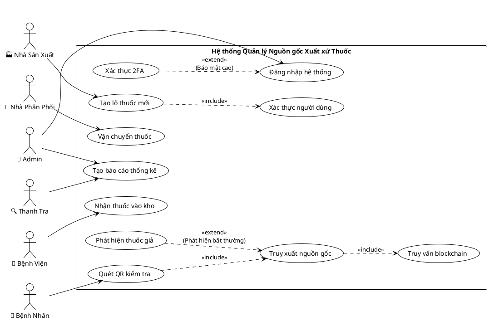

# THIẾT KẾ MÔ HÌNH STARUML
## HỆ THỐNG QUẢN LÝ NGUỒN GỐC XUẤT XỨ THUỐC BẰNG BLOCKCHAIN

---

## 🎯 1. CÁC ACTOR TRONG HỆ THỐNG

### 1.1 Định nghĩa Actor

| **Actor** | **Mô tả** | **Vai trò chính** | **Quyền hạn** |
|-----------|-----------|-------------------|---------------|
| **👤 Admin** | Quản trị viên hệ thống | Quản lý toàn bộ hệ thống | Toàn quyền |
| **🏭 Nhà Sản Xuất** | Công ty dược phẩm | Tạo và quản lý lô thuốc | Tạo, Cập nhật lô thuốc |
| **🚛 Nhà Phân Phối** | Đơn vị vận chuyển | Vận chuyển thuốc | Cập nhật trạng thái vận chuyển |
| **🏥 Bệnh Viện** | Cơ sở y tế | Nhận và cấp phát thuốc | Quản lý kho, Cấp phát |
| **👨‍⚕️ Dược Sĩ** | Nhân viên y tế | Kiểm tra và cấp thuốc | Xác minh, Cấp phát |
| **👤 Bệnh Nhân** | Người sử dụng cuối | Nhận và kiểm tra thuốc | Quét QR, Xem thông tin |
| **🔍 Thanh Tra** | Cơ quan quản lý | Giám sát và kiểm tra | Xem báo cáo, Audit |

### 1.2 Mã StarUML cho Actor

```json
{
  "actors": [
    {
      "id": "Actor_Admin",
      "name": "Admin",
      "stereotype": "<<actor>>",
      "description": "Quản trị viên hệ thống với toàn quyền",
      "attributes": [
        "adminId: String",
        "role: AdminRole",
        "permissions: List<Permission>"
      ]
    },
    {
      "id": "Actor_Manufacturer", 
      "name": "Nhà Sản Xuất",
      "stereotype": "<<actor>>",
      "description": "Công ty dược phẩm sản xuất thuốc",
      "attributes": [
        "manufacturerId: String",
        "companyName: String",
        "licenseNumber: String",
        "address: String"
      ]
    },
    {
      "id": "Actor_Distributor",
      "name": "Nhà Phân Phối", 
      "stereotype": "<<actor>>",
      "description": "Đơn vị vận chuyển và phân phối thuốc",
      "attributes": [
        "distributorId: String",
        "companyName: String",
        "transportLicense: String"
      ]
    },
    {
      "id": "Actor_Hospital",
      "name": "Bệnh Viện",
      "stereotype": "<<actor>>",
      "description": "Cơ sở y tế nhận và cấp phát thuốc",
      "attributes": [
        "hospitalId: String",
        "hospitalName: String",
        "address: String",
        "licenseNumber: String"
      ]
    },
    {
      "id": "Actor_Pharmacist",
      "name": "Dược Sĩ",
      "stereotype": "<<actor>>", 
      "description": "Nhân viên y tế kiểm tra và cấp thuốc",
      "attributes": [
        "pharmacistId: String",
        "fullName: String",
        "licenseNumber: String",
        "hospitalId: String"
      ]
    },
    {
      "id": "Actor_Patient",
      "name": "Bệnh Nhân",
      "stereotype": "<<actor>>",
      "description": "Người sử dụng cuối, nhận và kiểm tra thuốc",
      "attributes": [
        "patientId: String",
        "fullName: String",
        "phoneNumber: String"
      ]
    },
    {
      "id": "Actor_Inspector",
      "name": "Thanh Tra",
      "stereotype": "<<actor>>",
      "description": "Cơ quan quản lý giám sát hệ thống",
      "attributes": [
        "inspectorId: String",
        "agency: String",
        "authority: String"
      ]
    }
  ]
}
```

---

## 🎯 2. CÁC USE CASE CHÍNH

### 2.1 Danh sách Use Case theo Module

#### **Module 1: Quản lý Tài khoản**
- UC001: Đăng ký tài khoản
- UC002: Đăng nhập hệ thống  
- UC003: Quản lý hồ sơ
- UC004: Phân quyền người dùng

#### **Module 2: Quản lý Lô Thuốc**
- UC005: Tạo lô thuốc mới
- UC006: Cập nhật thông tin lô thuốc
- UC007: Xóa/Vô hiệu hóa lô thuốc
- UC008: Truy vấn thông tin lô thuốc
- UC009: Tạo mã QR

#### **Module 3: Chuỗi Cung Ứng (Core)**
- UC010: Ghi nhận sản xuất
- UC011: Xác nhận vận chuyển
- UC012: Nhập kho bệnh viện
- UC013: Cấp phát cho bệnh nhân
- UC014: Truy xuất nguồn gốc
- UC015: Phát hiện thuốc giả

#### **Module 4: Giao Nhiệm Vụ**
- UC016: Tạo nhiệm vụ
- UC017: Theo dõi tiến độ
- UC018: Hoàn thành nhiệm vụ

#### **Module 5: Thông Báo**
- UC019: Gửi thông báo
- UC020: Nhận thông báo
- UC021: Quản lý thông báo

#### **Module 6: Đánh Giá**
- UC022: Đánh giá chất lượng thuốc
- UC023: Đánh giá dịch vụ
- UC024: Xử lý phản hồi

#### **Module 7: Thống Kê**
- UC025: Tạo báo cáo thống kê
- UC026: Xem dashboard
- UC027: Xuất báo cáo

#### **Module 8: Bảo Mật**
- UC028: Mã hóa dữ liệu
- UC029: Xác thực blockchain
- UC030: Audit hệ thống

### 2.2 Mã StarUML cho Use Case

```json
{
  "usecases": [
    {
      "id": "UC005",
      "name": "Tạo lô thuốc mới",
      "description": "Nhà sản xuất tạo lô thuốc mới và ghi lên blockchain",
      "preconditions": [
        "Nhà sản xuất đã đăng nhập",
        "Có quyền tạo lô thuốc"
      ],
      "postconditions": [
        "Lô thuốc được tạo thành công",
        "Thông tin được ghi lên blockchain",
        "Mã QR được tạo"
      ],
      "mainFlow": [
        "1. Nhà sản xuất nhập thông tin lô thuốc",
        "2. Hệ thống validate thông tin",
        "3. Tạo Smart Contract trên blockchain", 
        "4. Sinh mã QR duy nhất",
        "5. Lưu thông tin vào database",
        "6. Trả về kết quả cho người dùng"
      ],
      "alternativeFlow": [
        "2a. Thông tin không hợp lệ -> Hiển thị lỗi",
        "3a. Blockchain lỗi -> Thử lại hoặc báo lỗi"
      ]
    },
    {
      "id": "UC014", 
      "name": "Truy xuất nguồn gốc",
      "description": "Truy vấn đầy đủ lịch sử của lô thuốc từ blockchain",
      "preconditions": [
        "Có mã QR hoặc Batch ID hợp lệ"
      ],
      "postconditions": [
        "Hiển thị đầy đủ lịch sử lô thuốc",
        "Xác minh tính hợp lệ"
      ],
      "mainFlow": [
        "1. Quét mã QR hoặc nhập Batch ID",
        "2. Truy vấn Smart Contract",
        "3. Lấy dữ liệu từ blockchain",
        "4. Xác minh chữ ký số",
        "5. Hiển thị lịch sử đầy đủ"
      ]
    },
    {
      "id": "UC015",
      "name": "Phát hiện thuốc giả", 
      "description": "Kiểm tra và phát hiện thuốc giả thông qua blockchain",
      "preconditions": [
        "Có thông tin thuốc cần kiểm tra"
      ],
      "postconditions": [
        "Xác định thuốc thật/giả",
        "Ghi log nếu phát hiện thuốc giả"
      ],
      "mainFlow": [
        "1. So sánh thông tin với blockchain",
        "2. Kiểm tra tính toàn vẹn dữ liệu", 
        "3. Xác minh chữ ký số",
        "4. Đưa ra kết luận",
        "5. Cảnh báo nếu phát hiện thuốc giả"
      ]
    }
  ]
}
```

---

## 🔗 3. CÁC LOẠI DÂY NỐI (RELATIONSHIPS)

### 3.1 Association (Liên kết)

**Mô tả:** Kết nối trực tiếp giữa Actor và Use Case

```
Actor ────────► Use Case
```

**Ví dụ trong hệ thống:**
- Nhà Sản Xuất ────────► Tạo lô thuốc mới
- Bệnh Nhân ────────► Truy xuất nguồn gốc  
- Admin ────────► Quản lý hệ thống

### 3.2 Include (Bao gồm)

**Mô tả:** Use Case A luôn gọi Use Case B

```
Use Case A ────include────► Use Case B
```

**Ví dụ trong hệ thống:**
- Tạo lô thuốc mới ────include────► Xác thực người dùng
- Truy xuất nguồn gốc ────include────► Truy vấn blockchain
- Cập nhật thông tin ────include────► Ghi log hoạt động

### 3.3 Extend (Mở rộng)

**Mô tả:** Use Case B có thể mở rộng Use Case A trong điều kiện nhất định

```
Use Case A ◄────extend──── Use Case B
```

**Ví dụ trong hệ thống:**
- Truy xuất nguồn gốc ◄────extend──── Phát hiện thuốc giả
- Đăng nhập hệ thống ◄────extend──── Xác thực 2FA
- Tạo báo cáo ◄────extend──── Gửi email báo cáo

### 3.4 Generalization (Tổng quát hóa)

**Mô tả:** Quan hệ kế thừa giữa các Actor hoặc Use Case

```
Actor Con ────────► Actor Cha
```

**Ví dụ trong hệ thống:**
- Dược Sĩ ────────► Nhân Viên Y Tế
- Admin ────────► Người Dùng Hệ Thống
- Thanh Tra ────────► Cơ Quan Quản Lý

---

## 📋 4. MÔ HÌNH USE CASE DIAGRAM HOÀN CHỈNH

### 4.1 Mã StarUML JSON

```json
{
  "model": {
    "name": "Hệ thống Quản lý Nguồn gốc Xuất xứ Thuốc",
    "type": "UseCaseDiagram",
    "elements": {
      "actors": [
        {
          "id": "admin",
          "name": "Admin", 
          "position": {"x": 50, "y": 100}
        },
        {
          "id": "manufacturer",
          "name": "Nhà Sản Xuất",
          "position": {"x": 50, "y": 200}
        },
        {
          "id": "distributor", 
          "name": "Nhà Phân Phối",
          "position": {"x": 50, "y": 300}
        },
        {
          "id": "hospital",
          "name": "Bệnh Viện", 
          "position": {"x": 50, "y": 400}
        },
        {
          "id": "patient",
          "name": "Bệnh Nhân",
          "position": {"x": 50, "y": 500}
        },
        {
          "id": "inspector",
          "name": "Thanh Tra",
          "position": {"x": 50, "y": 600}
        }
      ],
      "usecases": [
        {
          "id": "uc_login",
          "name": "Đăng nhập hệ thống",
          "position": {"x": 300, "y": 150}
        },
        {
          "id": "uc_create_batch",
          "name": "Tạo lô thuốc mới", 
          "position": {"x": 400, "y": 200}
        },
        {
          "id": "uc_transport",
          "name": "Vận chuyển thuốc",
          "position": {"x": 400, "y": 300}
        },
        {
          "id": "uc_receive", 
          "name": "Nhận thuốc vào kho",
          "position": {"x": 400, "y": 400}
        },
        {
          "id": "uc_scan_qr",
          "name": "Quét QR kiểm tra",
          "position": {"x": 400, "y": 500}
        },
        {
          "id": "uc_trace",
          "name": "Truy xuất nguồn gốc", 
          "position": {"x": 600, "y": 450}
        },
        {
          "id": "uc_detect_fake",
          "name": "Phát hiện thuốc giả",
          "position": {"x": 600, "y": 550}
        },
        {
          "id": "uc_blockchain",
          "name": "Truy vấn blockchain",
          "position": {"x": 800, "y": 400}
        },
        {
          "id": "uc_auth",
          "name": "Xác thực người dùng",
          "position": {"x": 800, "y": 200}
        },
        {
          "id": "uc_report",
          "name": "Tạo báo cáo thống kê",
          "position": {"x": 400, "y": 100}
        }
      ],
      "relationships": [
        // Association relationships
        {
          "type": "Association",
          "from": "admin", 
          "to": "uc_login"
        },
        {
          "type": "Association",
          "from": "admin",
          "to": "uc_report"
        },
        {
          "type": "Association", 
          "from": "manufacturer",
          "to": "uc_create_batch"
        },
        {
          "type": "Association",
          "from": "distributor",
          "to": "uc_transport" 
        },
        {
          "type": "Association",
          "from": "hospital", 
          "to": "uc_receive"
        },
        {
          "type": "Association",
          "from": "patient",
          "to": "uc_scan_qr"
        },
        
        // Include relationships
        {
          "type": "Include",
          "from": "uc_create_batch",
          "to": "uc_auth",
          "label": "<<include>>"
        },
        {
          "type": "Include", 
          "from": "uc_scan_qr",
          "to": "uc_trace",
          "label": "<<include>>"
        },
        {
          "type": "Include",
          "from": "uc_trace", 
          "to": "uc_blockchain",
          "label": "<<include>>"
        },
        
        // Extend relationships
        {
          "type": "Extend",
          "from": "uc_detect_fake",
          "to": "uc_trace", 
          "label": "<<extend>>",
          "condition": "Phát hiện bất thường"
        },
        {
          "type": "Extend",
          "from": "uc_2fa",
          "to": "uc_login",
          "label": "<<extend>>", 
          "condition": "Yêu cầu bảo mật cao"
        }
      ]
    }
  }
}
```

### 4.2 Mã PlantUML tương ứng



---

## 🏗️ 5. ACTIVITY DIAGRAM - LUỒNG HOẠT ĐỘNG

### 5.1 Mã StarUML cho Activity Diagram

```json
{
  "activityDiagram": {
    "name": "Quy trình Tạo và Kiểm tra Lô Thuốc",
    "swimlanes": [
      {
        "name": "Nhà Sản Xuất",
        "activities": [
          "Đăng nhập hệ thống",
          "Nhập thông tin lô thuốc", 
          "Tạo Smart Contract",
          "Sinh mã QR"
        ]
      },
      {
        "name": "Blockchain",
        "activities": [
          "Validate thông tin",
          "Ghi dữ liệu",
          "Trả về hash"
        ]
      },
      {
        "name": "Bệnh Nhân", 
        "activities": [
          "Quét mã QR",
          "Truy vấn thông tin",
          "Xem kết quả"
        ]
      }
    ],
    "flow": [
      "start -> Đăng nhập hệ thống",
      "Đăng nhập hệ thống -> Nhập thông tin lô thuốc",
      "Nhập thông tin lô thuốc -> Validate thông tin", 
      "Validate thông tin -> [valid] Tạo Smart Contract",
      "Validate thông tin -> [invalid] Hiển thị lỗi",
      "Tạo Smart Contract -> Ghi dữ liệu",
      "Ghi dữ liệu -> Sinh mã QR",
      "Sinh mã QR -> end",
      "Quét mã QR -> Truy vấn thông tin",
      "Truy vấn thông tin -> Xem kết quả"
    ]
  }
}
```

---

## 📊 6. CLASS DIAGRAM - MÔ HÌNH LỚP

### 6.1 Các lớp chính trong hệ thống

```json
{
  "classes": [
    {
      "name": "User",
      "type": "abstract",
      "attributes": [
        "- userId: String",
        "- username: String", 
        "- password: String",
        "- email: String",
        "- role: UserRole",
        "- createdAt: DateTime"
      ],
      "methods": [
        "+ login(): Boolean",
        "+ logout(): void",
        "+ updateProfile(): void"
      ]
    },
    {
      "name": "Manufacturer", 
      "extends": "User",
      "attributes": [
        "- companyName: String",
        "- licenseNumber: String",
        "- address: String"
      ],
      "methods": [
        "+ createDrugBatch(): DrugBatch",
        "+ updateBatchInfo(): void"
      ]
    },
    {
      "name": "DrugBatch",
      "attributes": [
        "- batchId: String",
        "- drugName: String", 
        "- manufacturerId: String",
        "- productionDate: Date",
        "- expiryDate: Date",
        "- quantity: Integer",
        "- qrCode: String",
        "- blockchainHash: String"
      ],
      "methods": [
        "+ generateQRCode(): String",
        "+ writeToBlockchain(): String",
        "+ validateBatch(): Boolean"
      ]
    },
    {
      "name": "SupplyChain",
      "attributes": [
        "- chainId: String",
        "- batchId: String",
        "- currentLocation: String", 
        "- status: ChainStatus",
        "- timestamp: DateTime"
      ],
      "methods": [
        "+ updateLocation(): void",
        "+ getFullHistory(): List<ChainEvent>",
        "+ verifyIntegrity(): Boolean"
      ]
    },
    {
      "name": "SmartContract",
      "attributes": [
        "- contractAddress: String",
        "- abi: String",
        "- deployedAt: DateTime"
      ],
      "methods": [
        "+ createBatch(): String", 
        "+ updateBatch(): void",
        "+ getBatchInfo(): DrugBatch",
        "+ verifyBatch(): Boolean"
      ]
    }
  ],
  "relationships": [
    {
      "from": "Manufacturer",
      "to": "DrugBatch", 
      "type": "creates",
      "multiplicity": "1..*"
    },
    {
      "from": "DrugBatch",
      "to": "SupplyChain",
      "type": "has",
      "multiplicity": "1"
    },
    {
      "from": "SupplyChain", 
      "to": "SmartContract",
      "type": "uses",
      "multiplicity": "1"
    }
  ]
}
```

---

## 🎯 7. HƯỚNG DẪN SỬ DỤNG TRONG STARUML

### 7.1 Các bước tạo Use Case Diagram

1. **Tạo Project mới:**
   - File → New → Project
   - Chọn template "UML Standard Profile"

2. **Thêm Use Case Diagram:**
   - Right-click Model → Add Diagram → Use Case Diagram

3. **Thêm Actor:**
   - Kéo Actor từ Toolbox vào diagram
   - Đặt tên theo danh sách trên

4. **Thêm Use Case:**
   - Kéo Use Case từ Toolbox
   - Đặt tên theo chức năng

5. **Tạo các mối quan hệ:**
   - **Association:** Kéo từ Actor đến Use Case
   - **Include:** Kéo Include từ Use Case A đến Use Case B
   - **Extend:** Kéo Extend từ Use Case B đến Use Case A
   - **Generalization:** Kéo từ Actor con đến Actor cha

### 7.2 Thiết lập Properties

#### **Cho Actor:**
```
Name: Nhà Sản Xuất
Stereotype: <<actor>>
Documentation: Công ty dược phẩm sản xuất thuốc
```

#### **Cho Use Case:**
```
Name: Tạo lô thuốc mới
Preconditions: Nhà sản xuất đã đăng nhập, Có quyền tạo lô thuốc
Postconditions: Lô thuốc được tạo thành công, Thông tin được ghi lên blockchain
```

#### **Cho Include Relationship:**
```
Stereotype: <<include>>
Name: include
```

#### **Cho Extend Relationship:**
```
Stereotype: <<extend>>
Name: extend
Extension Points: Phát hiện bất thường
```

### 7.3 Styling và Layout

```json
{
  "styling": {
    "actor": {
      "fillColor": "#E3F2FD",
      "fontColor": "#1976D2", 
      "fontSize": 12
    },
    "usecase": {
      "fillColor": "#F3E5F5",
      "fontColor": "#7B1FA2",
      "fontSize": 10
    },
    "association": {
      "lineColor": "#424242",
      "lineWidth": 1
    },
    "include": {
      "lineColor": "#4CAF50", 
      "lineStyle": "dashed"
    },
    "extend": {
      "lineColor": "#FF9800",
      "lineStyle": "dashed"
    }
  }
}
```

---

## 📋 8. CHECKLIST HOÀN THÀNH MÔ HÌNH

### ✅ Actor Checklist
- [ ] Định nghĩa đầy đủ 7 actor chính
- [ ] Thiết lập thuộc tính cho từng actor
- [ ] Xác định quyền hạn và vai trò
- [ ] Tạo quan hệ kế thừa (nếu có)

### ✅ Use Case Checklist  
- [ ] Liệt kê đầy đủ 30 use case
- [ ] Viết mô tả chi tiết cho use case quan trọng
- [ ] Xác định preconditions và postconditions
- [ ] Mô tả main flow và alternative flow

### ✅ Relationship Checklist
- [ ] Tạo Association giữa Actor và Use Case
- [ ] Xác định các mối quan hệ Include
- [ ] Xác định các mối quan hệ Extend  
- [ ] Thiết lập Generalization (nếu có)

### ✅ Documentation Checklist
- [ ] Thêm mô tả cho tất cả elements
- [ ] Thiết lập stereotype phù hợp
- [ ] Tạo notes giải thích phức tạp
- [ ] Export diagram thành hình ảnh

---

*🎯 Tài liệu này cung cấp đầy đủ thông tin để tạo mô hình StarUML hoàn chỉnh cho Hệ thống Quản lý Nguồn gốc Xuất xứ Thuốc bằng Blockchain.*